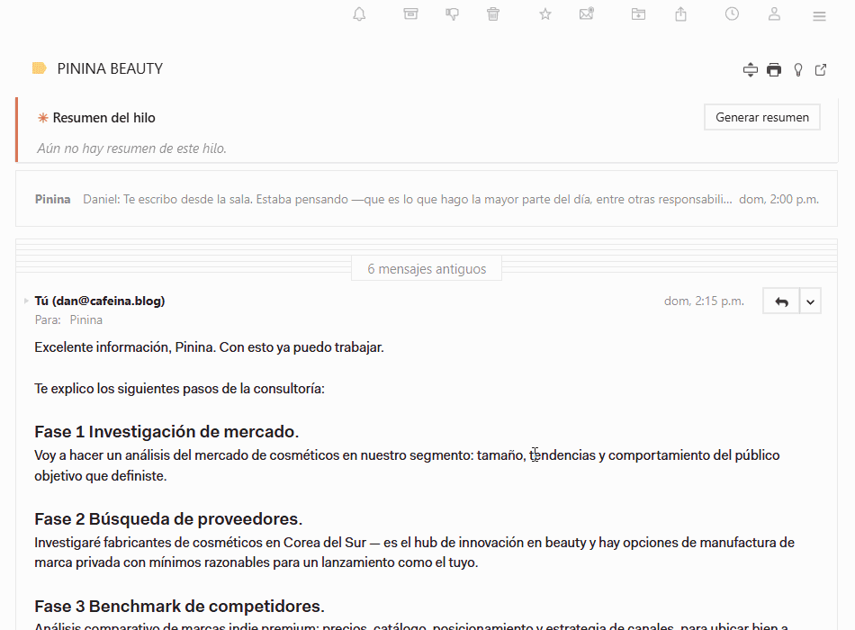
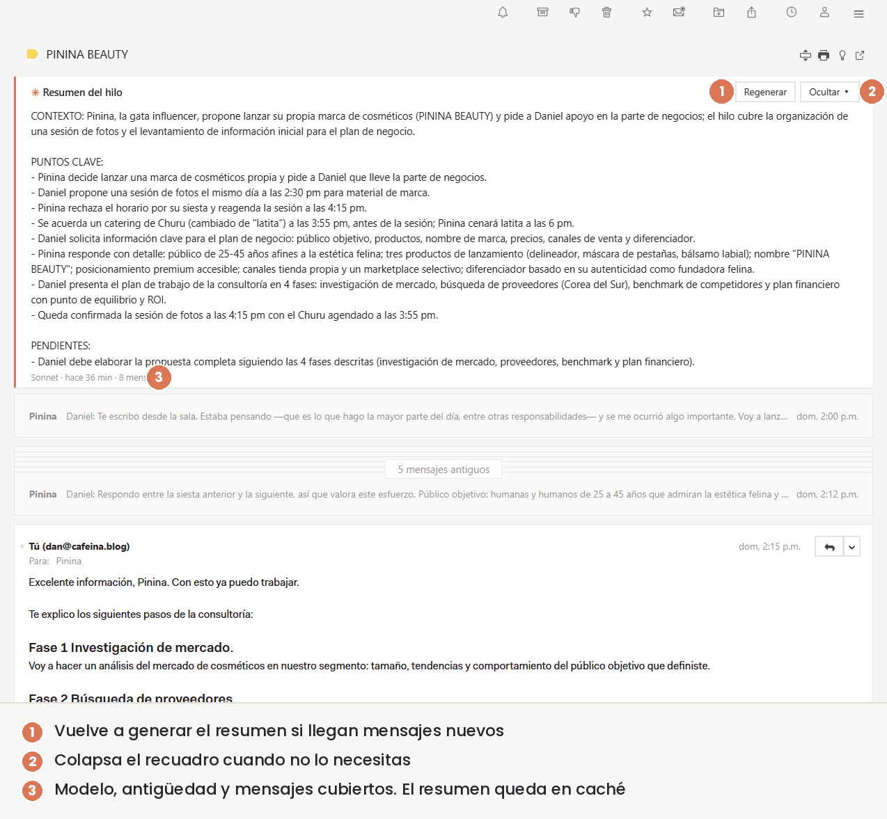
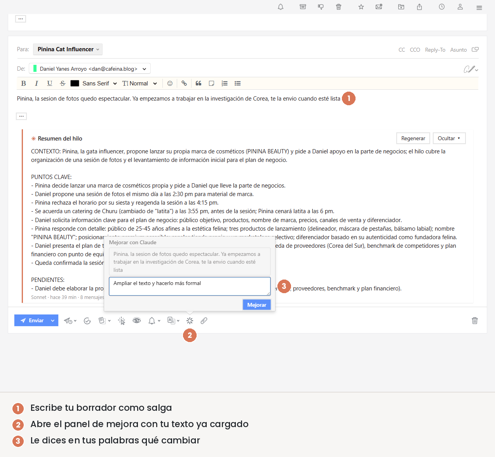
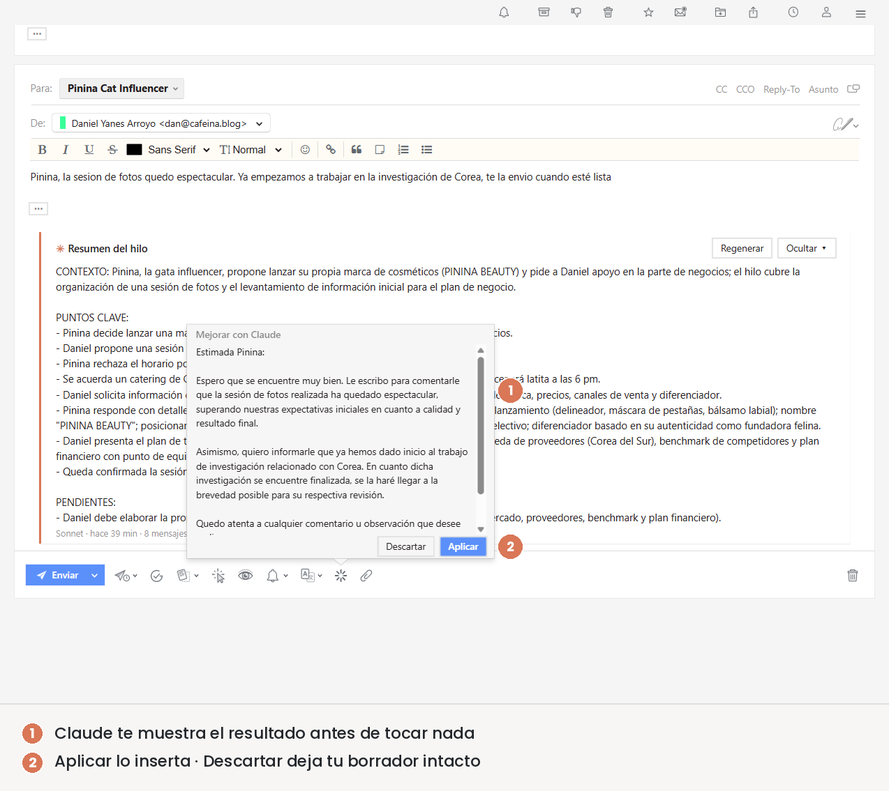
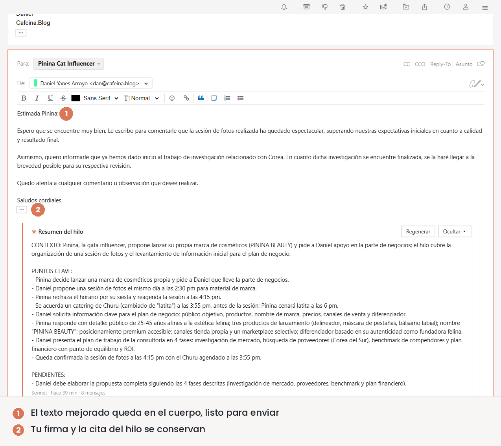
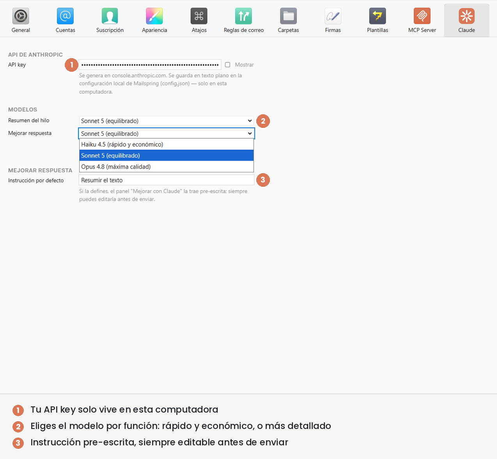

[English](README.md) · **Español**

# Mailspring Claude Assistant

Un plugin no oficial para [Mailspring](https://getmailspring.com/) que integra la IA de Claude
(Anthropic) directamente en tu cliente de correo: **resume hilos** completos y **mejora tus
respuestas** antes de enviarlas, sin salir del compositor. Todo el procesamiento es en **texto
plano** — el plugin nunca modifica el HTML de tus correos.

<p align="center">
  
</p>

> ⚠️ Este es un proyecto personal y no oficial, sin relación con Mailspring ni con Anthropic.
> Usa la API de Anthropic con **tu propia** clave (pago por uso).

---

## Funciones

### ✳ Resumir hilo

Un recuadro que resume toda la conversación (con sus pendientes) y aparece tanto en la cabecera del
hilo como dentro del compositor mientras redactas. Pulsa **Generar resumen** y el resultado se
guarda por hilo: al volver aparece al instante, y si llegan mensajes nuevos te avisa para
regenerarlo. Puedes colapsarlo cuando no lo necesites.

<p align="center">
  
</p>

<p align="center"><em>El resumen vive en la cabecera del hilo (y también en el compositor), compartiendo el mismo resultado.</em></p>

### ✳ Mejorar respuesta

Escribe tu borrador como salga, dale una instrucción libre ("hazlo más formal", "acórtalo",
"tradúcelo al inglés") y Claude propone una versión mejorada. La revisas en una vista previa y
eliges **Aplicar** o **Descartar** — tu firma y la cita del mensaje original se conservan intactas.

<p align="center">
  
</p>

<p align="center"><em>1. Escribes tu borrador · 2. Abres el panel de mejora · 3. Le dices en tus palabras qué cambiar.</em></p>

<p align="center">
  
</p>

<p align="center"><em>Claude te muestra el resultado antes de tocar nada: Aplicar lo inserta, Descartar deja tu borrador intacto.</em></p>

<p align="center">
  
</p>

<p align="center"><em>El texto mejorado queda en el cuerpo, listo para enviar; tu firma y la cita del hilo se conservan.</em></p>

### ✳ Idioma de la interfaz

El plugin sigue el idioma configurado en Mailspring (**Preferencias → General → Idioma de la
interfaz**). Por ahora incluye traducciones a **inglés**, **español**, **portugués** y **portugués
de Brasil**; cualquier otro idioma cae a inglés. Se aceptan traducciones nuevas — ver
[Contribuir](#contribuir).

Los resúmenes y las respuestas mejoradas **no** dependen de este ajuste: Claude sigue el idioma del
hilo o del borrador, así que un correo en alemán recibe un resumen en alemán sin importar en qué
idioma tengas la interfaz.

---

## Requisitos

- **Mailspring 1.22** o superior.
- Una **API key de Anthropic**. Se obtiene en [console.anthropic.com](https://console.anthropic.com)
  (es de pago por uso). Recomendado: ponle un límite de gasto mensual.

## Instalación (usuarios)

No necesitas programar ni compilar nada: el plugin ya viene compilado.

1. Ve a la sección **[Releases](https://github.com/cafeinablog/mailspring-claude-assistant/releases)**
   y descarga el archivo `mailspring-claude-assistant.zip` de la última versión.
2. Descomprímelo. Obtendrás una carpeta llamada `mailspring-claude-assistant`.
3. Muévela a la carpeta de plugins de Mailspring, según tu sistema operativo:
   - **Windows:** `%APPDATA%\Mailspring\packages`
   - **macOS:** `~/Library/Application Support/Mailspring/packages`
   - **Linux:** `~/.config/Mailspring/packages`

   (En Windows puedes pegar `%APPDATA%\Mailspring\packages` en la barra de direcciones del
   Explorador para llegar directo.)
4. **Reinicia Mailspring.**
5. Abre **Preferencias → Claude** y pega tu API key. ¡Listo!

## Configuración

Todo se ajusta en **Preferencias → Claude**:

- **API key** — tu clave de Anthropic.
- **Modelos** — qué modelo usar para resumir y para mejorar. Para resúmenes más detallados, elige
  un modelo de mayor calidad; para ahorrar, uno más económico.
- **Instrucción por defecto** (opcional) — texto que aparece ya escrito en el panel de mejora.

<p align="center">
  
</p>

<p align="center"><em>La pestaña Claude en Preferencias: tu API key (enmascarada), el modelo para cada función y la instrucción por defecto.</em></p>

## Privacidad y seguridad

- Tu API key se guarda **en texto plano** en la configuración local de Mailspring (`config.json`),
  únicamente en tu computadora. Mailspring no ofrece almacenamiento cifrado para plugins.
- El contenido de los correos que resumes o mejoras se envía a la API de Anthropic para su
  procesamiento. Revisa la [política de privacidad de Anthropic](https://www.anthropic.com/legal/privacy).
- Recomendado: usa una API key con **límite de gasto** y, si quieres, con vencimiento.

---

## Desarrollo

El código fuente está en `src/` (TypeScript/JSX) y se compila a `lib/` (JavaScript plano, que es lo
que Mailspring carga y lo que se versiona en el repo — Mailspring no transpila).

```bash
git clone https://github.com/cafeinablog/mailspring-claude-assistant.git
cd mailspring-claude-assistant
npm install
npm run build
```

Para desarrollo iterativo conviene enlazar el repo a la carpeta de plugins con un *junction*
(Windows) o *symlink*, y recargar Mailspring con **Ctrl+Shift+R** tras cada `npm run build`:

```powershell
New-Item -ItemType Junction `
  -Path "$env:APPDATA\Mailspring\packages\mailspring-claude-assistant" `
  -Target (Get-Location)
```

### Agregar una traducción

Todos los textos visibles viven en un solo archivo, [`src/i18n.js`](src/i18n.js). Para sumar un
idioma, copia el bloque `en`, traduce los valores (las claves no se tocan) y agrégalo bajo su
código de idioma. Ten en cuenta que Mailspring reporta el locale completo con región (`es-MX`,
`pt-BR`, `es_419`), así que una entrada `pt` cubre todas las variantes del portugués, mientras que
una entrada específica `pt-BR` tiene prioridad sobre ella cuando las variantes sí difieren.

### Ramas

- **`main`** — versión estable y publicada (lo que se distribuye en *Releases*).
- **`develop`** — trabajo en curso. Los cambios se integran aquí y, cuando están listos, se
  promueven a `main` con una nueva versión.

## Contribuir

Las incidencias y sugerencias son bienvenidas en
[Issues](https://github.com/cafeinablog/mailspring-claude-assistant/issues). Si envías un Pull
Request, hazlo contra la rama `develop`.

## Supervisión del proyecto

<p align="center">
  
</p>

<p align="center"><em>Pinina supervisando el desarrollo. Todo el código fue revisado desde su torre. 🐱</em></p>

## Acerca de Cafeina.Blog

Este plugin es un proyecto derivado de **[Cafeina.Blog](https://cafeina.blog)** — un proyecto
personal de Daniel Yanes Arroyo dedicado a crear herramientas y contenido para optimizar procesos
de negocios y emprendimientos: plantillas de Excel y Google Sheets para planificación financiera,
proyección de ventas, control de gastos y medición de KPIs, además de un blog semanal sobre
negocios, marketing y productividad.

La idea es la misma que hay detrás de este plugin: herramientas prácticas, sin teoría innecesaria.
(Y sí — Pinina también supervisa allá.)

## Licencia

[MIT](LICENSE)
